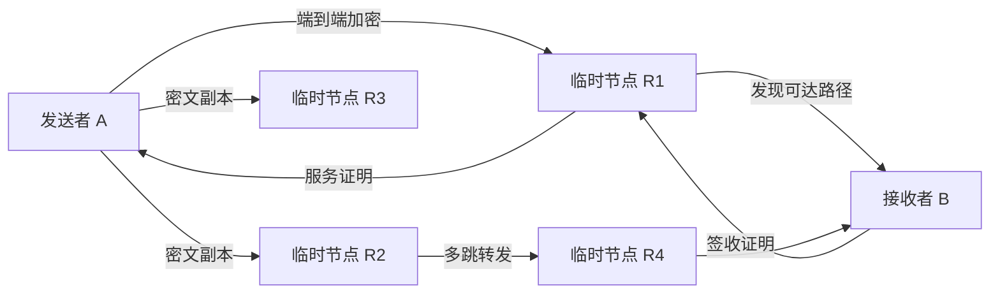

# bitchat / FARP

FARP 是一个面向弱网、断网和跨网络场景的去中心化聊天协议实验。

它只做聊天，不发行具有现实价值的资产，也不建立全网统一账本。聊天内容长期只保存在发送者和接收者设备中；中间节点仅在完成离线暂存、路由或转发任务所需的时间内持有端到端加密的数据包，任务完成或到期后删除缓存。

> 当前仓库处于协议设计和 v0.1 骨架阶段，不应直接用于生产环境或承载重要通信。

## 核心目标

1. 构建无需中心聊天服务器的 P2P 聊天网络。
2. 聊天消息不上链、不进入公共数据库，长期数据只属于通信双方。
3. 通过临时密文暂存和多节点转发，提高离线、弱网及常规路径不可达时的送达概率。
4. 使用不可交易的贡献配额鼓励节点互助，配额只能消费 FARP 聊天相关服务。
5. 使用单活设备链和上一设备绑定的 PUK 恢复机制保护账户控制权。
6. 优先保护个人设备、树莓派、旧电脑和低配 VPS，任何贡献等级都不能突破节点的硬件安全上限。

## 不可变原则

### 消息只属于通信双方

- 明文聊天记录只保存在发送者和接收者的本地设备。
- 所有离线消息在离开发送设备前完成端到端加密。
- 中间节点只接触任务所需的密文包、任务标识和下一跳信息。
- 中间节点完成投递、收到删除指令或达到 TTL 后删除缓存。
- 协议不能证明远端磁盘发生了物理擦除，因此安全性必须首先依赖端到端加密和密钥轮换，而不能依赖节点的删除承诺。

### 在线不等于贡献

单纯启动程序、保持在线或等待任务不会产生配额。只有完成可验证的聊天网络服务才会产生配额：

- 成功暂存并按约定交付离线密文包。
- 成功完成直接转发或多节点转发。
- 提供有效路由并帮助请求方连接目标节点。
- 完成随机见证并返回有效签名。
- 按约定保存密文，并通过保存挑战或最终交付证明。

统一规则：

```text
接受任务 != 获得配额
保持在线 != 获得配额
尝试转发 != 获得配额

有效任务证明 + 必要签名 + 见证确认 = 配额产生
```

### 配额不是货币

- 没有预挖、创世分配或全网总量上限。
- 每个账户初始配额为 0，只能通过完成服务产生。
- 配额不可转让、不可交易、不可兑换现实货币。
- 配额永久有效，不按时间衰减，也不因长期未消费而过期。
- 配额只能用于 FARP 内部的聊天相关服务，例如离线暂存、额外副本和多跳转发。
- FARP 不提供通用存储、通用计算、金融支付或聊天之外的商品和服务。

建议将贡献状态拆成三个独立值：

```text
SpendableCredit
  = 已验证贡献奖励 - 服务消费 - 主动销毁

LifetimeContribution
  = 历史全部有效贡献，只增不减

BurnedCredit
  = 历史主动销毁配额，只增不减
```

大量配额代表节点曾经提供大量服务，但不赋予无限带宽、无限存储或绕过安全限流的权力。

## 网络模型



### 直接消息

当 A 能直接连接 B 时，消息通过端到端加密的 P2P 通道发送。寻址结果在本地缓存，TTL 内不重复请求公共节点。

### 离线消息

当 B 不在线、常规路径不可达或 A 主动选择离线投递时：

1. A 创建唯一的 `task_id`，并将消息封装为只对 B 可解密的密文包。
2. A 从可用节点中随机选择若干节点，发送多个密文副本或加密分片。
3. 暂存节点返回签名回执，但此时不立即获得完整投递奖励。
4. 任一节点发现 B 上线或找到可达下一跳后，尝试直接或多跳投递。
5. B 验证消息后返回绑定 `task_id` 和实际投递节点的签收证明。
6. 投递节点取得 A、B 的必要签名以及随机见证证明后，获得贡献配额。
7. 任务完成后，参与节点删除对应密文缓存；任务长期未完成则按 TTL 清理。

暂存贡献和最终投递贡献应分别计量，避免节点只接受数据却不尝试送达，也避免节点实际承担长期存储后完全得不到回报。具体奖励比例尚未确定。

## 无全局账本的贡献证明

FARP 不维护区块链，也不要求所有节点同步全网余额。账户在本地保存自己的贡献凭证，少量随机见证节点只保存防止重复领奖和重复消费所需的最小状态。

### 任务结算标记

节点完成任务并获得 A、B 的签名后，生成贡献凭证，同时广播一条零额度的任务结算标记：

```text
IssueMarker {
  task_id
  owner_pubkey
  reward_amount
  proof_hash
}
```

这里的“0 配额消耗”不是实际扣费，而是标记该 `task_id` 已经产生过奖励，防止节点恢复旧快照后使用同一份服务证明重复领奖。

### 消费与滚动见证

账户使用配额请求其他节点提供服务时，需要原见证组中的若干节点对当前状态进行核验和签名。消费完成后：

1. 新的随机见证组接收账户最新状态。
2. 新组确认接管后，向旧见证组发送状态已作废和完成交接的证明。
3. 旧组删除交易详情，仅在必要的安全窗口内保留极小的退休标记。
4. 退休状态过期后继续清理，避免历史记录无限增长。

这是一种按账户分片的滚动证明状态，不是全网统一账本。

### 两层随机见证草案

当前讨论中的候选算法：

1. 请求方根据固定任务或账户状态随机选出 5 个 `Selector`。
2. 每个 Selector 使用可验证随机过程再选择 3 个 `Witness`。
3. 最终 Witness 集合不包含最初的 5 个 Selector，并应去重、跨域分散。
4. Selector 只负责抽取，不参与最终见证签名。
5. 同一个 `task_id` 或账户状态版本必须得到可复算的相同选择结果，禁止通过反复请求重新抽签。

暂定使用三分之一见证作为弱网下的服务确认目标。该阈值在网络分区、恶意见证和双重消费场景下仍存在安全与可用性的权衡；账户状态最终交接、旧记录删除条件及极端离线恢复规则尚未定稿，需要在实现前通过威胁建模和模拟确定。

## 域

用户可以创建自己的小域并邀请朋友、同事或可信节点加入。域用于：

- 提供初始节点发现和社会信任边界。
- 限制见证节点过度集中在同一个控制者或同一个网络环境。
- 为 Selector 和 Witness 提供跨域候选池。

域不是聊天服务器，也不是独立区块链。域成熟条件、合并规则、抗批量伪造机制和初始网络激活条件仍处于讨论阶段。

## 单活设备与 PUK

同一账户只允许一个设备处于 `ACTIVE` 状态。协议采用递增的 `device_epoch` 表示设备控制权：

```text
电脑 ACTIVE, epoch=10

电脑授权手机：
手机 ACTIVE, epoch=11
电脑 PREVIOUS，只保留恢复材料

手机丢失：
电脑本地恢复材料 + PUK
=> 电脑重新 ACTIVE, epoch=12
=> 手机 epoch=11 失效
```

正常迁移必须由当前 ACTIVE 设备授权。迁移完成后：

- 新设备成为唯一 ACTIVE。
- 原设备成为唯一 PREVIOUS 恢复设备。
- 更早设备的恢复资格被删除。
- 联系人、聊天记录和密钥状态通过本地 P2P 通道迁移，不上传公共服务器。

PUK 不是完整账户私钥。恢复必须同时具备：

```text
上一台设备保存的恢复秘密 + 用户持有的高强度 PUK
```

PUK 单独不能在任意新设备恢复账户。如果当前设备和上一设备同时损坏或丢失，即使持有 PUK 也无法恢复，账户将永久失去控制权。

在完全去中心化和网络分区环境下，无法保证所有节点瞬间得知设备已经切换。每条消息必须携带 `device_epoch`；节点一旦看到更高 epoch，就永久拒绝旧 epoch，实现最终收敛到单一 ACTIVE 设备。

## 限流与硬件保护

- 公共节点对同一身份的寻址、投递、见证和状态请求实施统一窗口限流，初始目标为每分钟 5 至 10 次。
- 高频消息先进入本地 SQLite 队列，再按短时间窗口批量加密投递。
- 路由结果保存在本地并设置 TTL，连接仍有效时不重复查询。
- 每个节点自行设置最大磁盘占用、单包大小、缓存 TTL、带宽、并发连接和任务队列长度。
- 贡献等级可以影响队列优先级、离线保存时长和副本数量，但不能突破节点的物理安全上限。
- 应用层限流不能替代操作系统防火墙和网络层 DDoS 防护。

## 奉献与荣誉

计划每三个月开放一次自愿贡献销毁窗口。用户可以永久销毁自己的可消费配额，生成可验证的 `BurnCertificate` 并向随机见证节点广播。

销毁证明只表达对网络的历史奉献，不产生现实资产，也不赋予无限服务。荣誉展示、证明长期保存和无全局账本条件下的跨域同步方式仍待设计。

## 非目标

FARP 不以以下能力为目标：

- 虚拟货币发行、交易、兑换或投机。
- 将聊天内容、联系人或消息索引写入链上。
- 建立全网统一余额账本或要求所有节点同步全部历史。
- 提供聊天之外的通用代理、通用存储、通用计算或支付服务。
- 通过余额或荣誉绕过硬件保护和安全限流。
- 承诺生产级匿名性、绝对删除证明或网络分区下的瞬时全网一致性。

## 当前代码状态

仓库目前包含 Go 编写的 v0.1 骨架：

```text
cmd/daemon       本地核心守护进程入口
cmd/cli          CLI 骨架
farp/identity    Ed25519 身份骨架
farp/messaging   消息信封和协议定义
farp/ratelimit   内存限流器
farp/pow         DHT 发布 PoW 实验
farp/ledger      早期积分结构，后续将按无全局账本模型调整
internal/api     localhost HTTP API 骨架
internal/db      SQLite schema
```

当前代码可以通过编译检查：

```bash
go test ./...
```

但身份持久化、真实端到端加密、签名验证、DHT、Relay、CLI 请求、见证协议、配额消费和设备迁移仍未完成。现有 API 和消息验证中包含占位实现，请勿将其视为安全实现。

## 建议推进顺序

1. 固化威胁模型、消息状态机、账户状态机和滚动见证协议。
2. 完成身份加密持久化、确定性序列化和消息签名验证。
3. 完成本地消息队列、端到端加密、直连发送和 ACK。
4. 完成离线密文暂存、多副本投递、TTL 清理和 Relay 回执。
5. 完成贡献证明、见证抽取、配额产生与消费。
6. 完成单活设备迁移、上一设备恢复和 PUK 流程。
7. 通过故障注入和大规模模拟验证弱网、节点离线、网络分区及恶意行为。

## 项目性质

本项目是高容灾、延迟容忍 P2P 通信协议的开源实验，不运营公共节点，不提供金融服务，不包含现实资金或可兑换资产。部署者应自行评估当地法律、网络安全和数据保护要求。

项目计划采用 MIT License，最终以仓库中的 `LICENSE` 文件为准。
